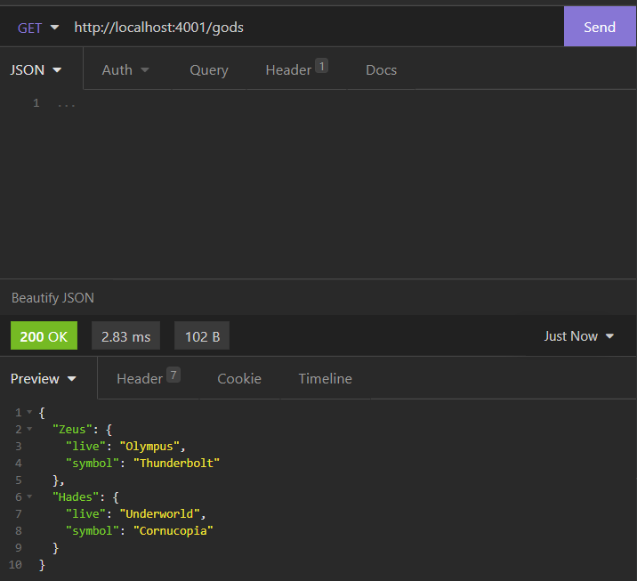

# Sesión 2 - Middleware API

En esencia, el middleware es la conexión que existe entre el lado del cliente (la interfaz de usuarix) y el lado del servidor (el servidor y la base de datos). Pensemos en el middleware como la plomería de una casa que se encarga de llevar todos los recursos (Agua, gas, electricidad, etc.) a las personas que la habitan.

El middleware debe proveer una interfaz de comunicación que se adapte tanto a las necesidades del cliente como las del servidor por lo que debe ser muy flexible.

## Instalación de ExpressJS

Para comenzar debemos tener esta estructura de directorios en nuestro proyecto:

nombre-proyecto/

├── config/

├── models/

├── controllers/

├── routes/

├── app.js

En la carpeta raíz **iniciamos** un nuevo proyecto con el comando

`npm init -y`

Instalamos **Express** con el comando:

`npm install express body-parser cors`

Instalamos **nodemon** con el comando:

`npm install -g nodemon`

Nodemon nos servirá para agilizar el desarrollo, ya que recarga nuestro server de manera automática, de esta manera no tendremos que reiniciar el servidor manualmente cada que realicemos cambios.

Agregar las lineas dentro de `package.json` en la llave "script"

```javascript
"scripts": {
  "start": "node ./app.js",
  "dev": "nodemon ./app.js"
}
```
Quedando de la siguiente manera:

```javascript
{
  "name": "sesion-2",
  "version": "1.0.0",
  "description": "",
  "main": "app.js",
  "scripts": {
    "test": "echo \"Error: no test specified\" && exit 1"
  },
  "keywords": [],
  "author": "",
  "license": "ISC",
  "dependencies": {
    "body-parser": "^1.19.0",
    "cors": "^2.8.5",
    "express": "^4.17.1"
  }
}
```

## Ejercicio de prueba

Abriremos el archivo app.js y lo iremos modificando. Se debe de importar el módulo de Express y se crea una instancia llamada `app`.

```javascript
const express = require('express');
const app = express();

```

Con la aplicación que creamos podemos iniciar un servidor que se encargará de escuchar las peticiones que se hagan a nuestra API y responderlas, pero para esto tenemos que indicarle en dónde escuchar peticiones dándole un puerto especifico. Para esto contamos con el método listen().

```javascript
const PORT = 4001;
app.listen(PORT, () => {
  console.log(`Server is listening on port ${PORT}`);
});
```

Para verificar que todo vaya bien ejecutamos el comando `npm run dev` el console.log que estamos mandando. Si todo esta bien se mostrará el mensaje como se muestra en la siguiente imagen:


 Para indicarle al servidor como reaccionar a cada petición se definen una serie de rutas. Para este ejemplo la ruta seria `http://localhost:4001/gods
`

En donde gods es la ruta de petición. Como desarrolladoras y desarrolladores de la API es nuestra tarea decirle al servidor como debe responder en cada una de las rutas.

Para programar como debe de reaccionar ante esta ruta de peticion se realiza el siguiente codigo.

```javascript
const gods = [
  { name: 'Zeus' },
  { name: 'Hades' },
  { name: 'Hermes' }
];
app.get('/gods', (req, res, next) => {
  res.send(gods);
});

```

Con este codigo lo que le estamos diciendo es como se debe comportar el servidor cuando le llegue una peticion `GET` con la ruta de `/gods`.

Para comprobar que esta funcionando de manera correcta, se realizara una peticion `GET` a la ruta `http://localhost:4001/gods` , esto se hara usando el programa insomnia. Al hacer esta peticion a esta ruta nos debe de devolver el arreglo `gods`. Al hacer la peticion el resultado es el siguiente.


## Ejemplo CRUD

Para que nuestra API sea REST era necesario que tener el CRUD completo y hasta ahora solo hemos trabajado con GET. Así como existe .get() Express tiene un método para cada petición de HTTP que funcionan de la misma forma.

|   | HTTP   | Express   |
|---|--------|-----------|
| C | `POST`   | `.post()`   |
| R | `GET`    | `.get()`    |
| U | `PUT`    | `.put()`    |
| D | `DELETE` | `.delete(`) |

Para poder acceder al body es necesario definir un mecanismo que lo parsee para convertirlo en un objeto de JavaScript. Recordemos que la API se encarga también de la compatibilidad de los datos entre las aplicaciones.

Nosotros vamos a usar `body-parser` que es una biblioteca de JavaScript que traduce el body de un request. Para usarla agregamos las siguientes lineas antes de la definición de los servicios.

El codigo queda de la siguiente manera incluyendo CRUD.

```javascript
const express = require('express');
const app = express();

const bodyParser = require('body-parser');
app.use(bodyParser.urlencoded({ extended: false }));
app.use(bodyParser.json());

const PORT = 4001;
app.listen(PORT, () => {
  console.log(`Server is listening on port ${PORT}`);
});

const gods = {
  Zeus: { live: 'Olympus', symbol: 'Thunderbolt' },
  Hades : { live : 'Underworld', symbol: 'Cornucopia' }
};

app.get('/gods', (req, res, next) => {
  res.send(gods);
});

app.get('/gods/:name', (req, res) =>{
  var name = req.params.name;
  var god = gods[name]
  if (god){
    res.send(god)
  } else {
    res.status(418).send("No encontre el dios")
  }
})

app.put('/gods/:name', (req, res)=>{
  var god = req.params.name;
  gods[god] = req.body
  res.send(gods)
})

app.post('/gods', (req,res)=>{
  var name = req.query.name;
  var info = req.body;
  gods[name] = info;
  res.status(200).send(gods)
})

app.delete('/gods/:name', (req,res)=>{
  var name = req.params.name;
  delete gods[name]
  res.send(gods)
})
```

Para probar cada uno de los metodos se usara Insomnia.

### Resultados
#### GET (Obetener)



#### PUT (Actualizar)
- Codigo:
  ```javascript
  app.put('/gods/:name', (req, res)=>{
    var god = req.params.name;
    gods[god] = req.body
    res.send(gods)
  })
  ```

- body:
  ```javascript
  {
    "live": "London",
    "symbol": "Perrito"
  }
  ```
- Resultado:


#### POST
- Codigo:
  ```javascript
  app.post('/gods', (req,res)=>{
    var name = req.query.name;
    var info = req.body;
    gods[name] = info;
    res.status(200).send(gods)
  })
  ```

- body:
  ```javascript
  {
    "live": "Ocean",
    "symbol": "Posseidon"
  }
  ```
- Resultado:


#### DELETE
- Codigo:
  ```javascript
  app.delete('/gods/:name', (req,res)=>{
  var name = req.params.name;
  delete gods[name]
  res.send(gods)
  ```

- Resultado:

