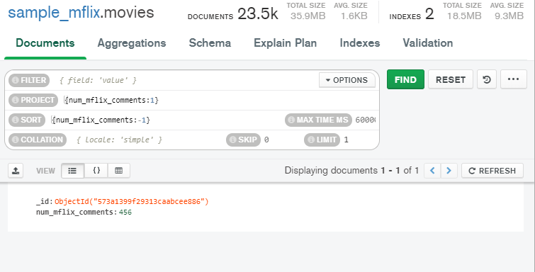

# Sesión 5: Bases de datos NoSQL (Mongo)

## Consultas

[Documentacion Mongo](https://docs.mongodb.com/manual/reference/operator/query/)

### Filter
`{$and: [{year : {$lte: 2019}}, {year: {$gte: 2012}}] }`

`{year: {$gte: 2012, $lte: 2019}}`

`{ house_rules:{$not: /party/}}`

### Sort
- Ascendente
`{year: 1}`

- Descendente
`{year: -1}`

### Uso de expresiones regulares

[Documentacion de expresiones regulares](https://developer.mozilla.org/es/docs/Web/JavaScript/Guide/Regular_Expressions)

[Documentacion de expresiones regulares](https://www.w3schools.com/jsref/jsref_obj_regexp.asp)

`{transit: /Metro/}`

Busqueda de la palabra metro sin importar mayusculas y minusculas (insensitive)

`{transit: /Metro/i}`

Empieza con la letra m
`{name: /^M/i}`

Terminacion de una cadena

`{email: /@cats.com$/}`

`{name: /[a-z]?[a-z]?[a-z]?[a-z]?[a-z]?/}`

`{name: /^[a-z]{0,5}?/}`

### Agregaciones
Las operaciones de agregación procesan los registros de datos y devuelven los resultados calculados. Las operaciones de agregación agrupan valores de varios documentos y pueden realizar una variedad de operaciones en los datos agrupados para devolver un único resultado. MongoDB proporciona tres formas de realizar la agregación: la canalización de agregación , la función de reducción de mapa y los métodos de agregación de propósito único .

## Retos

### Reto 1 (Consultas Basicas)

### Reto 2 (Expresiones Regulares)

### Reto 3 (Agregaciones)

