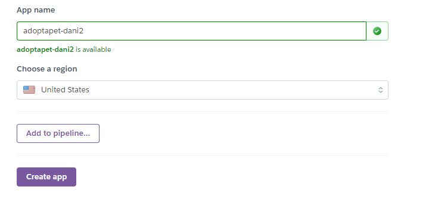
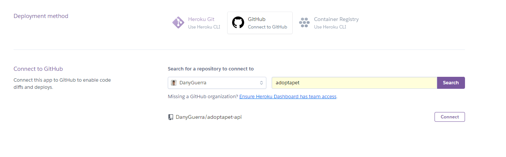
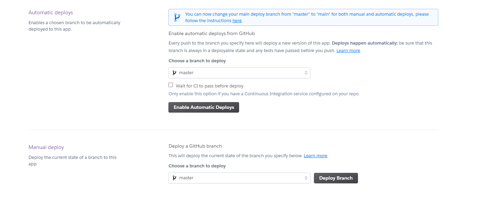
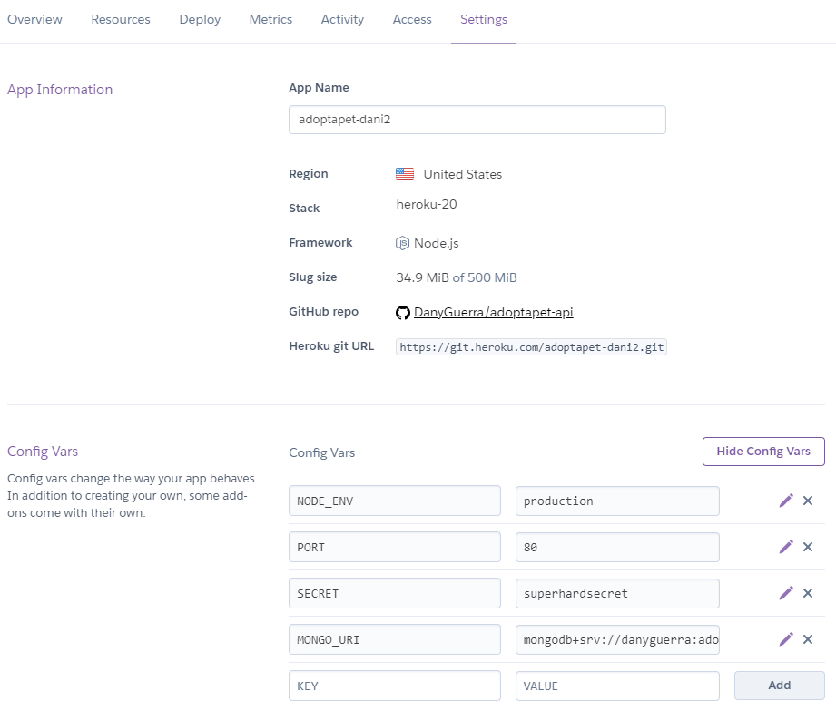
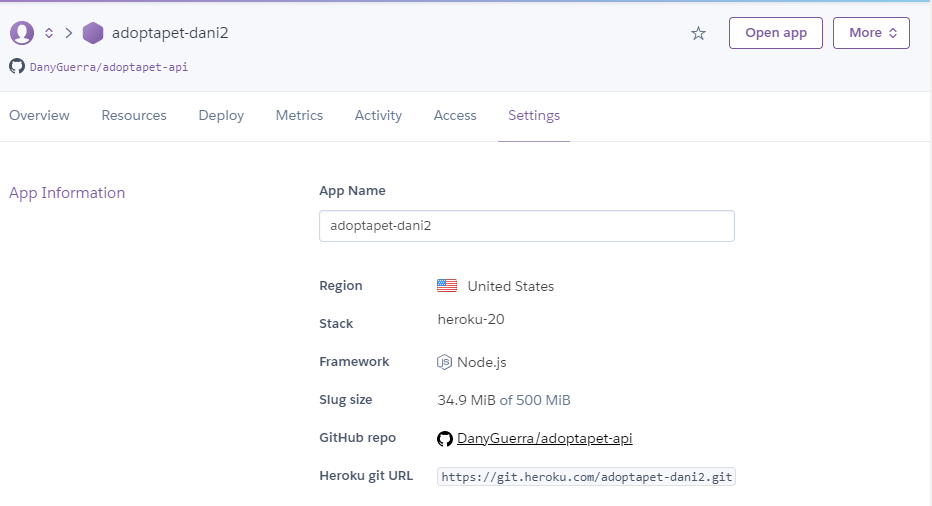
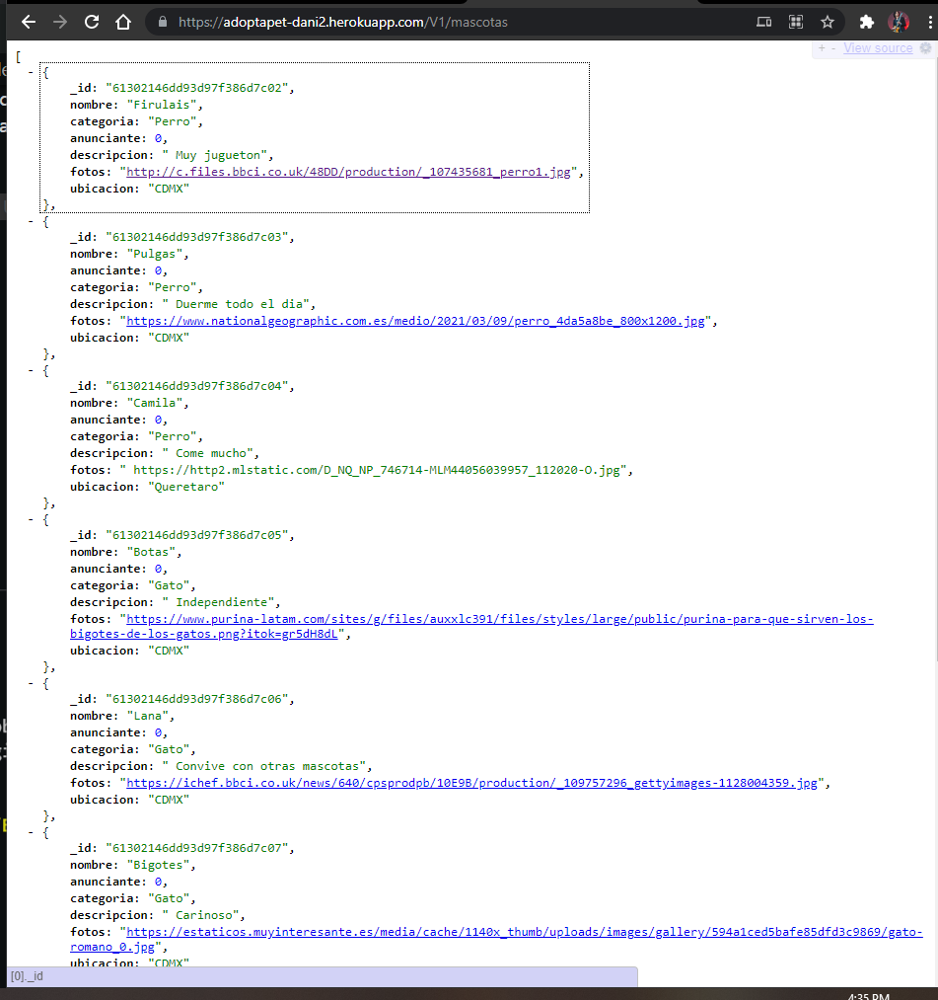

# Sesión 8: Deploy
[Link del deploy](https://adoptapet-dani.herokuapp.com/v1)

## Variables de entorno (localmente)
Se usan para poder crear variables que se encuentren alojadas en nuestra computadora o en el servidor, esto con el fin de proteger informacion sensible, en este caso el link de conexion a nuestra base de datos.

Creamos un archivo llamado `env.sh` en el directorio `config` y agregamos lo siguiente.

Nota: agregar en el archivo `.gitignore` el archivo `env.sh` .

```javascript
export NODE_ENV='development';
export PORT=4001;
export SECRET='secret';
export MONGO_URI='mongodb+srv://<username>:<password>@cluster0.tf5ep.mongodb.net/<NombreBaseDatos>?retryWrites=true&w=majority';
```

Para cargar las variables ejecutamos el script posicionandonos en la ruta del archivo `env.sh` y ejecutamos el comando:

``` bash
source ./env.sh
```

Modificamos el archivo de `app.js` modificando lo siguiente.

```javascript
mongoose.connect(
  process.env.MONGODB_URI, // obtiene la url de conexión desde las variables de entorno
  { useUnifiedTopology: true, useNewUrlParser: true, useCreateIndex: true }
);


app.listen(process.env.PORT, () => {
  console.log(`Server listening on port ${process.env.PORT}`)
})
```

Verificar que en el archivo `config/index.js` este el siguiente codigo.

```javascript
module.exports = {
  secret: process.env.NODE_ENV === "production" ? process.env.SECRET : "secret",
};
```

Una vez realizado esto corremos la aplicacion con `npm run dev` y verificamos que todo este de manera correcta.

## Variables de entorno (en servidor de deploy)

Para hacer deploy de la aplicacion se utilizara [Heroku](https://dashboard.heroku.com/apps).

Para este punto todo el codigo de la API debera estar en un repositorio de GitHub de esta manera sera posible realizar el deploy.

1. Lo primero sera crear un cuenta de heroku
2. Lo siguiente sera crear un nuevo deploy asignarle un nombre a la aplicacion y dar en el boton "create app"

   

3. Lo siguiente sera ir a la pestaña de deploy, seleccionar el metodo de deploy a GitHub y seleccionar el repositorio en donde esta nuestro codigo.

  

4. Despues de seleccionar el repositorio seleccionamos la rama (en este caso la rama master) y despues de esto seleccionamos en el boton de Deploy Branch.

  

5. Lo siguiente sera ir a la pestaña de `settings` iremos a la seccion de `config vars` y en esta seccion agregaremos las variables de entorno que agregamos en el archivo `config/env.sh` pero en esta ocasion las variables estaran hosteadas en el servidor de heroku.

 

6. Una vez realizado esto presionamos el boton de `Open App` y podremos consumir los servicios de nuestra API.

 

A continuacion se muestra un ejemplo obteniendo las mascotas de nuestra base de datos utilizando la apliacion hospedada en Heroku.

 

 Ya podemos consumir todos los servicios que realizamos en nuestra api.

 [LINK API TERMINADA!](https://adoptapet-dani2.herokuapp.com/v1/mascotas)